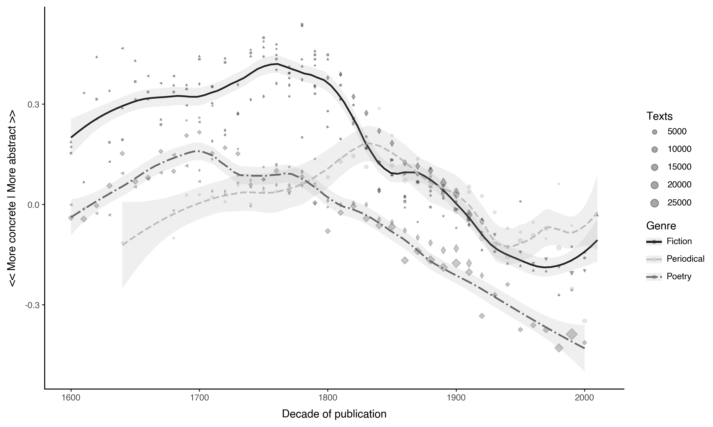
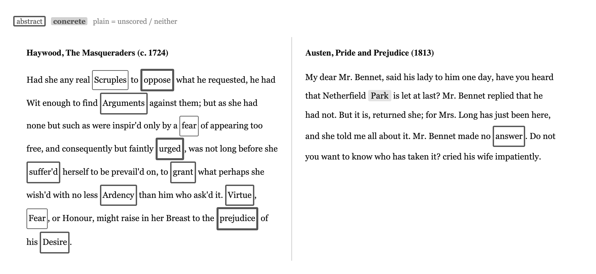
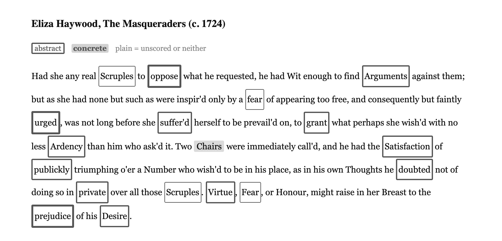

# Abstraction: A Literary History

Code and data for measuring abstract and concrete language across the history of English-language literature.

## The central finding

**Abstract language rose in English literature from the 1500s to a peak around 1700-1780, then fell steeply through the 20th century.** This pattern — a plateau followed by a cliff — appears across fiction, poetry, and periodical writing, confirmed across 34 corpora comprising ~1.27 million texts.



*The arc of abstraction across three genres. LOESS (span=0.3) on corpus-adjusted decade averages. Fiction shows a long plateau of peak abstractness ~1720-1780, then a steep sustained decline. Poetry peaks and breaks earliest (~1705/1720). Periodicals peak later (~1812).*

### Cross-genre results (piecewise regression with corpus fixed effects)

| Genre | Texts | Breakpoint | Rise slope | Fall slope | R² (scores) | R² (abstract %) | R² (concrete %) |
|---|---:|---:|---|---|---:|---:|---:|
| Fiction | 161,148 | 1760 | +0.0013/dec *** | -0.0029/dec *** | 0.882 | 0.820 | 0.900 |
| Poetry | 244,790 | 1700 | +0.0021/dec *** | -0.0019/dec *** | 0.881 | 0.794 | 0.904 |
| Periodical | 157,561 | 1830 | +0.0013/dec *** | -0.0018/dec *** | 0.870 | 0.849 | 0.787 |

#### Fiction (n = 161,148)

**Scores** (continuous weighted-mean concreteness, inverted so abstractness is up):
- 1600s: 0.2046 → 1750s: 0.3743 → 1990s: -0.2490
- Rise: +0.67 SD | Fall: +2.46 SD
- Breakpoint: 1760 | R² = 0.882
- Rise slope: +0.0013/decade (p = 7.5e-11) ***
- Fall slope: -0.0029/decade (p = 3.6e-83) ***

**Word proportions** (abstract: z ≤ -1.0, concrete: z > 1.0):

| Phase | Abstract | Concrete | Abs/Conc ratio |
|---|---|---|---|
| 1600s (start) | 18.8% | 9.4% | 2.0:1 |
| 1750s (peak) | 26.4% | 7.9% | 3.4:1 |
| 1990s (end) | 10.4% | 24.2% | 0.4:1 (1:2.3 conc/abs) |
| **Rise** (1600s→1750s) | 1.4x | 1.2x decline | 1.7x |
| **Fall** (1750s→1990s) | 2.5x decline | 3.1x increase | 7.8x decline |
| **Net** (1600s→1990s) | 1.8x decline | 2.6x increase | 4.6x decline |

R² abstract = 0.820, R² concrete = 0.900

#### Poetry (n = 244,790)

**Scores** (continuous weighted-mean concreteness, inverted so abstractness is up):
- 1610s: -0.0418 → 1690s: 0.1606 → 1980s: -0.4291
- Rise: +0.60 SD | Fall: +1.74 SD
- Breakpoint: 1700 | R² = 0.881
- Rise slope: +0.0021/decade (p = 6.9e-12) ***
- Fall slope: -0.0019/decade (p = 6.3e-52) ***

**Word proportions** (abstract: z ≤ -1.0, concrete: z > 1.0):

| Phase | Abstract | Concrete | Abs/Conc ratio |
|---|---|---|---|
| 1610s (start) | 10.3% | 12.4% | 0.8:1 (1:1.2 conc/abs) |
| 1690s (peak) | 16.3% | 9.8% | 1.7:1 |
| 1980s (end) | 7.7% | 31.3% | 0.2:1 (1:4.0 conc/abs) |
| **Rise** (1610s→1690s) | 1.6x | 1.3x decline | 2.0x |
| **Fall** (1690s→1980s) | 2.1x decline | 3.2x increase | 6.8x decline |
| **Net** (1610s→1980s) | 1.3x decline | 2.5x increase | 3.4x decline |

R² abstract = 0.794, R² concrete = 0.904

#### Periodical (n = 157,561)

**Scores** (continuous weighted-mean concreteness, inverted so abstractness is up):
- 1640s: -0.1142 → 1840s: 0.1735 → 2000s: 0.0312
- Rise: +0.82 SD | Fall: +0.41 SD
- Breakpoint: 1830 | R² = 0.870
- Rise slope: +0.0013/decade (p = 8.6e-06) ***
- Fall slope: -0.0018/decade (p = 3.5e-11) ***

**Word proportions** (abstract: z ≤ -1.0, concrete: z > 1.0):

| Phase | Abstract | Concrete | Abs/Conc ratio |
|---|---|---|---|
| 1640s (start) | 11.8% | 19.4% | 0.6:1 (1:1.7 conc/abs) |
| 1840s (peak) | 19.7% | 10.7% | 1.8:1 |
| 2000s (end) | 16.4% | 16.0% | 1.0:1 |
| **Rise** (1640s→1840s) | 1.7x | 1.8x decline | 3.0x |
| **Fall** (1840s→2000s) | 1.2x decline | 1.5x increase | 1.8x decline |
| **Net** (1640s→2000s) | 1.4x increase | 1.2x decline | 1.7x increase |

R² abstract = 0.849, R² concrete = 0.787

#### Prose summary

**Fiction** (n = 161,148): Abstractness rises from the 1600s to a peak in the 1750s (+0.67 SD), then falls through the 1990s (+2.46 SD). At peak, fiction has 3.4:1 abstract-to-concrete words, up from 2.0:1 in the 1600s (1.7x). By the 1990s, the ratio inverts to 0.4:1 (1:2.3 conc/abs) — a 7.8x decline from peak. Piecewise breakpoint at 1760; rise slope = +0.0013/decade (p = 7.5e-11), fall slope = -0.0029/decade (p = 3.6e-83); R² = 0.882.

**Poetry** (n = 244,790): Abstractness rises from the 1610s to a peak in the 1690s (+0.60 SD), then falls through the 1980s (+1.74 SD). At peak, poetry has 1.7:1 abstract-to-concrete words, up from 0.8:1 (1:1.2 conc/abs) in the 1610s. By the 1980s, the ratio inverts to 0.2:1 (1:4.0 conc/abs) — a 6.8x decline from peak. Piecewise breakpoint at 1700; rise slope = +0.0021/decade (p = 6.9e-12), fall slope = -0.0019/decade (p = 6.3e-52); R² = 0.881.

**Periodical** (n = 157,561): Abstractness rises from the 1640s to a peak in the 1840s (+0.82 SD), then falls through the 2000s (+0.41 SD). At peak, periodical has 1.8:1 abstract-to-concrete words, up from 0.6:1 (1:1.7 conc/abs) in the 1640s. By the 2000s it falls to 1.0:1. Piecewise breakpoint at 1830; rise slope = +0.0013/decade (p = 8.6e-06), fall slope = -0.0018/decade (p = 3.5e-11); R² = 0.870.

*(Scores: continuous weighted-mean concreteness, inverted. Proportions: frequency-weighted, abstract z ≤ -1.0, concrete z > 1.0. All regressions include corpus fixed effects.)*

<details>
<summary>Robustness: raw vs modernized spelling comparison</summary>

Spelling modernization (mapping historical forms like "vertue" to "virtue" via MorphAdorner) has minimal effect on the overall findings. Breakpoints, peak decades, and R² values are stable across both approaches. The main difference is in early-period baseline scores, where modernization slightly raises abstractness (more words match the norm vocabulary). Results below use raw spelling as the primary analysis.

| | Fiction | Poetry | Periodical |
|---|---|---|---|
| Breakpoint (raw) | 1760 | 1700 | 1830 |
| Breakpoint (mod) | 1760 | 1760 | 1830 |
| R² scores (raw) | 0.882 | 0.881 | 0.870 |
| R² scores (mod) | 0.884 | 0.887 | 0.871 |
| Abs/Conc rise (raw) | 2.0→3.4 (1.7x) | 0.8→1.7 (2.0x) | 0.6→1.8 (3.0x) |
| Abs/Conc rise (mod) | 2.3→3.3 (1.4x) | 1.3→1.7 (1.4x) | 0.6→1.8 (3.1x) |

The only notable divergence is poetry's score-based breakpoint, which shifts from 1700 (raw) to 1760 (modernized). This occurs because modernization slightly flattens the early rise (+0.60 SD raw → +0.36 SD modernized), making the pre-break slope non-significant (p = 0.78). The count-based breakpoint remains at 1690 in both cases.

Generated with `abstraction report-full --compare`.

</details>

## What drove the shift?

### Shift-share decomposition

Which *structural factors* — genre, text length, narrative form, author gender — drove the aggregate trend? A shift-share (Oaxaca-Blinder) decomposition splits the change between two periods into three components: **Composition** (the mix of categories shifted), **Within** (categories internally changed), and **Interaction** (categories that both grew and changed).

#### The rise: C17 (1600-1700) → C18 (1700-1800), +0.091

| Factor | Composition | Within | Interaction | Key finding |
|--------|:-----------:|:------:|:-----------:|-------------|
| Genre (raw) | 23% | 17% | 67% | Novel explodes from 3%→63% share; interaction dominates |
| Text length | 28% | 70% | 2% | All length bins got more abstract; NOT a Simpson's paradox |
| Genre x length (30K) | 0% | 18% | 89% | Long novels (>30K) drive the rise; short novels were *already* abstract |
| Epistolary | 9% | 86% | 5% | Both epistolary and non-epistolary rose; not an epistolary artifact |
| Narrative form (END) | 15% | 90% | -7% | First-person fiction transformed (0.12→0.43); epistolary born abstract |
| Author gender | 28% | 86% | -14% | Women drove the rise: 20%→47% share, high scores (0.48→0.56) |
| Author productivity | 8% | 102% | -9% | Evenly distributed; not driven by a few prolific authors |
| Translation | -1% | 100% | 1% | Irrelevant |

The rise is a complex story: the Novel's compositional takeover interacts with the rise of women writers, the emergence of epistolary fiction, and a transformation of first-person narration from picaresque concreteness to moral-psychological abstraction.

#### The fall: C18 (1700-1800) → C19 (1800-1900), -0.253

| Factor | Composition | Within | Interaction | Key finding |
|--------|:-----------:|:------:|:-----------:|-------------|
| Genre (raw) | -44% | -79% | 24% | Novel collapses 63%→11%; "Fiction" takes over at 81%, scoring low |
| Text length | 6% | -107% | 1% | Every length bin drops; broad-based concretization |
| Epistolary | -8% | -96% | 4% | Epistolary vanishes (14%→0.6%); but non-epistolary fell equally hard |
| Narrative form (END) | -16% | -80% | -2% | Epistolary disappearance biggest factor; third-person takes over |
| Author gender | -2% | -98% | 0% | Both genders decline in lockstep (women 0.56→0.31, men 0.46→0.22) |

The fall is simpler: broad-based concretization across all categories. The key asymmetry: **women drove the rise** (compositional + within), **but the decline was gender-blind**.

### Word-level analyses

Three word-level analyses identify which words are responsible.

### 1. Contribution decomposition

Which words' frequency changes mechanically drove the aggregate concreteness shift? Comparing 1700-1780 (abstract peak) to 1850-1950:

**Abstract words that declined** (removing abstraction):
| Word | Z-score | Freq change | Contribution |
|---|---|---|---|
| virtue | -1.59 | -90% | +2.38e-03 |
| reason | -1.57 | -62% | +2.40e-03 |
| passion | -1.27 | -77% | +2.19e-03 |
| favour | -1.48 | -83% | +1.89e-03 |
| opinion | -1.77 | -68% | +1.71e-03 |

**Concrete words that rose** (adding concreteness):
| Word | Z-score | Freq change | Contribution |
|---|---|---|---|
| white | +2.07 | +462% | +3.25e-03 |
| black | +1.62 | +265% | +1.80e-03 |
| hair | +1.86 | +276% | +1.52e-03 |
| blue | +2.05 | +681% | +1.32e-03 |
| window | +1.57 | +216% | +1.17e-03 |

**Counter-trend** (abstract words that *rose* despite the overall shift): *feeling* (+1064%), *fact* (+600%), *simply* (+2987%) — a new psychological/epistemic vocabulary replaced the old moral one.

Net: concretizing forces (+0.49) overwhelm abstracting (-0.10). All three word categories (Abstract, Concrete, Neither) net concretized.

### 2. Frequency correlation

Which words' frequency trajectories most closely track the overall concreteness trend? (Cosine similarity.)

**Tracking abstractness** (r ~ -0.93): *presumption, disposition, opinion, happiness, passion, favour, neglect, conceive, inclination* — the moral and psychological vocabulary of 18th-century fiction. 35 of the top 50 are classified Abstract.

**Tracking concreteness** (r ~ +0.20): *garage, bathroom, grabbed, cigarettes, elevator, sidewalk, kids* — modern material-world vocabulary. These appear only in 20th-century fiction.

The abstracting correlations are ~5x stronger than the concretizing ones: the decline of abstract vocabulary is more coherent than the rise of concrete vocabulary.

### 3. Semantic drift (vector norms)

Which words changed what they *mean* — independent of how often they appear? Using Word2Vec models trained on period-specific corpora (C17 vs C19):

- 60.5% of words drifted toward abstraction; only 39.5% toward concreteness
- Mean shift = -0.14 z-score (toward abstraction)
- *hollowness*: concrete in C17 (+1.67) → abstract in C19 (-1.56)
- *callous*: concrete (+1.58) → abstract (-1.23) — literal to metaphorical

Words themselves drifted abstract even as fiction chose more concrete words.

## Passage visualization

The package renders passages with per-word grayscale styling for print:
- **Abstract words**: bordered (thicker border = more abstract)
- **Concrete words**: bold with gray background (darker = more concrete)



*Left: Eliza Haywood, The Masqueraders (c. 1724) — dense with bordered abstract words (Scruples, Arguments, Virtue, Fear, Desire). Right: Jane Austen, Pride and Prejudice (1813) — mostly plain text with occasional concrete shading.*



```python
from abstraction import display_passage, display_comparison, save_passage_image

# Render in Jupyter
display_passage(text, title="Haywood, The Masqueraders (1724)")

# Side-by-side comparison
display_comparison([
    {"text": haywood_text, "title": "Haywood (1724)"},
    {"text": austen_text, "title": "Austen (1813)"},
])

# Save as 300 DPI PNG for print
save_passage_image(text, "output.png", dpi=300)
```

## Setup

Requires Python 3.9+. Recommended: Python 3.10 via pyenv.

```bash
cd abstraction
python -m venv .venv
source .venv/bin/activate
pip install -e .
```

For LLM features (text generation with caching):
```bash
pip install -e ".[llm]"
```

For passage image export:
```bash
pip install playwright
playwright install chromium
```

## Data layout

The package expects two data directories:

### Corpora (`~/lltk_data/corpora/`)

Each corpus is a directory containing metadata and either plain-text files or pre-computed word frequencies:

```
~/lltk_data/corpora/canon_fiction/
    metadata.csv          # must have 'id' column; typically also: author, title, year
    txt/                  # raw text files
        text_id_1.txt
    freqs/                # pre-computed word frequency JSONs
        text_id_1.json    # {"word": count, ...}
```

The path is configurable via `abstraction.config.PATH_CORPORA`. Corpus names use CamelCase in code (`CanonFiction`) and snake_case on disk (`canon_fiction`).

### Generated data (`./data/`)

Intermediate and output data lives in `data/` (not tracked in git):

```
data/
    fields/                # word norms, semantic field definitions
        sources/           # raw downloaded norm files
        data.allnorms.pkl  # cached combined norms DataFrame
    models/                # trained Word2Vec models by corpus/period/run
    counts/v2-raw/         # per-corpus JSONL bin counts (raw spelling, default)
    counts/v2/             # per-corpus JSONL bin counts (modernized spelling)
    scores/v8-raw/         # per-corpus CSVs of text-level norm scores (raw spelling, default)
    scores/v8/             # per-corpus CSVs of text-level norm scores (modernized spelling)
    psgs/                  # generated passage markdown files
    stash/                 # LLM response cache
    figures/               # saved plots
```

## Package modules

| Module | Purpose |
|--------|---------|
| `config.py` | Path constants and hyperparameters (`ZCUT`, `COUNT_WINDOW_LEN`, etc.) |
| `corpus.py` | `Corpus` class, `load_corpus()`, `pmap()`/`pmap_iter()` for parallelism |
| `tokenize.py` | Tokenization, spelling modernization, stopword filtering |
| `norms.py` | English psycholinguistic norms: load/combine, classify words, z-score, semantic fields |
| `norms_fr.py` | French word norms (Bonin 2018 concreteness + Desrochers 2009 imageability); mirrors `norms.py`'s schema |
| `norms_de.py` | German word norms (7 human-rated sources; Kanske reverse-coded) |
| `norms_es.py` | Spanish word norms (Guasch 2015 + optional EsPal) |
| `counting.py` | Sliding-window abstract/concrete word counting |
| `scoring.py` | Text/passage scoring; current CH/DuckDB scorers (`score_ids_ch`, `score_ids_duckdb`) plus the legacy CSV-walking scorers |
| `aggregate.py` | Aggregates per-text ClickHouse scores into arc-level DataFrames; `get_arc_scores(dedup="within_lang_group"|"rep_only")` |
| `corpus_correction.py` | Corpus bias estimation from within-match-group comparisons (fixed-effects estimator) |
| `scores_db.py` | DEPRECATED — legacy pre-ClickHouse DuckDB scores store (`scores.duckdb`); read-only archaeology, nothing writes to it anymore |
| `models.py` | Word2Vec training, vector field computation, historical vector norms |
| `analysis.py` | Arc detection/quantification: piecewise/LOESS fitting, decade reports, shift-share decomposition helpers |
| `words.py` | Word-trend analysis: frequency correlation, contribution decomposition, score shifts |
| `passages.py` | Per-word HTML/PNG passage visualization for print |
| `plotting.py` | plotnine-based visualization (norm plots, arc plots, LOESS) |
| `llm.py` | LLM text generation with litellm + hashstash caching |
| `app/` | FastAPI backend: `db.py` (ClickHouse client + `init_db()` + `CHConn` compat shim), `validation.py` (SQL/path param checks), `routes/{arc,decompose,meta,passage,trajectory}.py`; paired with the `frontend/` SvelteKit UI, served via `abstraction app` |
| `cli.py` | CLI entrypoint (20 subcommands — see CLI section below) |
| `utils.py` | DataFrame I/O, streaming CSV writer, z-scoring, HTML cleaning |

## CLI

20 subcommands, grouped below (`abstraction <command> --help` for full flag lists).

### Scoring

```bash
# Score corpora with freqs/ directories to CSV (default: arc corpora only)
abstraction score-corpora [corpora ...] [--all] [--force] [--workers N] [--modernize]

# Score a single corpus by directory name
abstraction score-corpus canon_fiction [--force] [--modernize]

# Score synthetic arc corpora (deduplicated by genre) to CSV
abstraction score-arcs [arcs ...] [--force] [--workers N] [--modernize]

# Score an LLTK corpus's texts via DuckDB freqs DB, 1:1 (no match-group averaging)
abstraction score-ids <corpus> [--lang en|fr|de|es] [--force] [--output PATH] [--shard-size N]

# Score all passages in lltk.passages, write to abstraction.passage_scores (ClickHouse)
abstraction score-passages [--lang en|fr|de] [--batch-size N] [--force]

# Estimate corpus bias coefficients from within-match-group comparisons
abstraction estimate-corpus-bias [--lang en|fr|de|es] [--score-col COL] [--reference CORPUS] [--min-overlap N]

# Check freqs/ coverage for corpora
abstraction check-freqs [corpus]

# Unpack hathi_englit TSV archives into freqs JSONs
abstraction fix-hathi-englit [--genres fiction,poetry]
```

### Counting

```bash
# Count z-score distributions for all corpora with freqs/
abstraction count-corpora [--force] [--norms NORMS] [--modernize]

# Count z-score distributions for a single corpus
abstraction count-corpus canon_fiction [--force] [--norms NORMS] [--modernize]
```

### Reporting

```bash
# Combined report: scores + word proportions + prose
abstraction report-full [-o report.md] [--csv results.csv] [--modernize]
abstraction report-full --compare [-o comparison.md]   # raw vs modernized side-by-side

# Piecewise arc statistics per genre (continuous scores)
abstraction report-arc [--genres Fiction,Poetry,Periodical] [--min-year Y] [--max-year Y] [--csv FILE] [--modernize]

# Arc statistics using word proportions (abstract/concrete %)
abstraction report-arc-counts [--abs-cutoff -1.0] [--conc-cutoff 1.0] [--norm COL] [--csv FILE] [--modernize]

# Shift-share (Oaxaca-Blinder) decomposition of abstractness change by genre tags
abstraction genre-tag-shift --period-a 1700-1750 --period-b 1800-1850 \
    [--arc arc_fiction] [--col Abs-Conc.Median.median] [--facet form|mode|register|flat|all] [--min-count N] [--csv FILE]
```

### Training & vector norms

```bash
# Generate skipgram files from a corpus by period
abstraction train-skipgrams CanonFiction [--period-len 100] [--workers N] [--force] [--output-dir DIR] [--fast] [--max-skipgrams N]

# Train a single Word2Vec model from a skipgrams file
abstraction train-model data/models/.../skipgrams.txt.gz [--runs N] [--workers N] [--dims 100] [--window 10] [--verbose]

# Train Word2Vec models for every skipgrams file under a directory
abstraction train-all data/models_century5 [--runs 5] [--workers N] [--dims 100] [--window 10] [--verbose]

# Generate IC (information content) norms from model vocabularies
abstraction gen-icnorms [--model-dir data/models/]

# Generate vector norms (Abs-Conc.*) from trained models
abstraction gen-vecnorms [--lang en|fr|de|es] [--period-len 100] [--model-dir DIR] [--workers N]
```

### Web app

```bash
# Start the web app (FastAPI backend + SvelteKit frontend);
# --refresh rebuilds the ClickHouse abstraction.scores / scores_rep tables + views
abstraction app [--backend-only] [--frontend-only] [--host HOST] [--port PORT] [--frontend-port PORT] [--refresh]
```

## Notebooks

25 notebooks under `notebooks/`. `*-executed.ipynb` files alongside a few of these are papermill output copies (gitignored), not separate notebooks.

| Notebook | Topic |
|----------|-------|
| `01-word-norms` | Load and explore psycholinguistic norms, classify words, visualize across sources |
| `02-counting` | Score passages, sliding-window counting, compare abstract vs. concrete text |
| `03-fiction-trends` | Plot abstraction trends across fiction history by genre |
| `04-passages` | Find extreme passages, stratified sampling, per-book passage generation |
| `05-models` | Inspect Word2Vec models, explore word neighborhoods, vector norms pipeline |
| `06-corpus` | Explore the Corpus class, list available corpora, read and tokenize texts |
| `07-arc-analysis` / `07-arc-analysis-v2` | Cross-corpus arc fitting, LOESS vs parametric, genre comparisons |
| `08-character-abstraction` | Character abstraction via bimodal character-quote networks + quote scoring |
| `09-character-intros` | Character-introduction classification analysis (BookNLP-derived) |
| `10-discrimination-analysis` | Ch5: cross-task (lltk/largeliterarymodels/abstraction) discrimination analysis |
| `11-passage-abstractness` | Ch5: passage abstractness broken down by narratological annotation tag |
| `12-embedding-variance-partition` | dbRDA variance partitioning on e5 passage embeddings (content vs. form vs. genre vs. period) |
| `13-ch5-cross-language` | Ch5: cross-language (English vs. French) passage content comparison |
| `14-umap-exploration` | UMAP exploration of passage and text embeddings |
| `15-character-naming` | Character naming conventions across the rise of the novel |
| `16-plot-genre` | Plot-genre annotations across the rise of the novel |
| `17-subgenre` | Subgenre annotations, pre-1800 fiction |
| `18-character-types` | Character archetype + social class x abstractness |
| `19-setting-abstractness` | Setting x passage abstractness, Path A annotation scheme |
| `ESTCCounts` / `-2` / `-3` | Legacy ESTC bibliography title-word and genre-term counting exploration; imports a `book_history` helper module no longer in the package, so not runnable as-is |
| `ESTCMatch` | Legacy ESTC/ECCO/EEBO metadata-matching exploration; same stale-import caveat as above |
| `LLMPsgs2-Analyze-Pamela` | Legacy `abslithist`-era LLM passage-annotation analysis for Richardson's *Pamela* |
| `PamelaPassages` | Legacy LLM passage-scoring prototype for *Pamela*, precursor to the current passage-annotation pipeline (`largeliterarymodels`) |

## Tests

```bash
source .venv/bin/activate
python -m pytest tests/ -v

# Skip tests that need local data files / corpora (~/lltk_data, data/fields/):
python -m pytest tests/ -v -m "not integration"
```

`tests/conftest.py` owns the norm-mocking contract shared across files (`install_fake_norms`, autouse cache-reset fixtures for `scoring._NORM_DICTS`/`_NORMS_ARRAYS_CACHE`) and registers the `integration` and `slow` pytest markers.

| Test file | Coverage |
|-----------|----------|
| `test_corpus.py` | camel_to_snake, `Corpus` class (metadata/text_path/read_text), pmap |
| `test_tokenize.py` | tokenize, tokenize_agnostic, strip_punct |
| `test_norms.py` | classify_word, get_contrasts, format_norms_as_long |
| `test_utils.py` | zfy, read/save_df, get_avgs_df, get_slices, cleanhtml, parse_json_str |
| `test_scoring.py` | score_freqs, score_words, walk_freqs, corpus scoring pipeline |
| `test_pct_scoring.py` | `_pct_abs`/`_pct_conc` frequency-proportion columns, assign_period_score |
| `test_counting.py` | count_absconc, count_absconc_psg sliding-window edge cases |
| `test_corpus_correction.py` | connected components, estimate_corpus_bias (exact recovery, SEs), save/load coefficients |
| `test_plotting.py` | _compress_year |
| `test_passages.py` | _word_style scaling, render_body, HTML rendering, flags, PNG export (marked `slow`) |
| `test_words.py` | frequency correlation, contribution decomposition, score shifts |
| `test_cli.py` | `--help` exit codes, score-corpus/score-corpora end-to-end via a fixture corpus |
| `test_ci_integration.py` | Cross-module flows against the bundled fixture corpus/norms under `tests/fixtures/` — no local data required |
| `test_integration.py` | End-to-end pipeline against real local norms + `~/lltk_data/corpora/canon_fiction` (marked `integration`; auto-skips if data is absent) |

## Key concepts

**Word norms** are published psycholinguistic ratings of how concrete or abstract a word is:

| Abbreviation | Source | What it measures |
|-------------|--------|-----------------|
| `PAV-Conc` | Paivio et al. (1968) | Concreteness |
| `PAV-Imag` | Paivio et al. (1968) | Imagery |
| `MRC-Conc` | MRC Psycholinguistic Database (1987) | Concreteness |
| `MRC-Imag` | MRC (1987) | Imagery |
| `MT-Conc` | Brysbaert et al. (2014) | Concreteness (Mechanical Turk) |
| `LSN-Imag` | Lancaster Sensorimotor Norms (2017) | Visual strength |
| `LSN-Hapt` | Lancaster (2017) | Haptic strength |

**Semantic fields**: words classified by z-score threshold. With `ZCUT = 1.0`: z >= 1.0 = **Concrete**, z <= -1.0 = **Abstract**, rest = **Neither**.

**Vector norms**: historical concreteness scores from period-specific Word2Vec models (C16, C17, C18, C19, C20). Measures how concrete a word was *as used in that era*.

**Scoring** (continuous): weighted-mean concreteness per text across 56 norm columns. Used for trend fitting and regression.

**Counting** (proportions): sliding 100-word window, counting abstract/concrete/neither words. Used for human-readable ratios ("26% of words were abstract at the 1750s peak vs 10% in the 1990s").

## How historical word norms are built

Modern psycholinguistic norms (Paivio, Brysbaert, etc.) tell us how abstract or concrete a word is *today*. But language changes: "virtue" was used more concretely in the 17th century (a force you could almost touch) than in the 19th (a vague moral quality). To capture this, we train Word2Vec models on period-specific corpora and use them to build historical concreteness scores.

### The pipeline

**Step 1: Skipgrams.** For each corpus-period (e.g. EEBO-TCP 1500-1600, ECCO 1700-1800), extract word co-occurrence pairs from the texts. These are saved as compressed text files.

```
abstraction train-skipgrams BLBooks --output-dir data/models
```

**Step 2: Word2Vec training.** Train Word2Vec (100 dimensions, window=10) on the skipgrams. Multiple runs per corpus-period (target: 5) provide robustness — the median across runs smooths out random initialization effects.

```
abstraction train-all data/models --runs 5
```

**Step 3: Contrast vectors.** From the modern norms, we know which words are abstract (z <= -1: *virtue, justice, reason*...) and which are concrete (z >= 1: *stone, rock, hand*...). In each trained model, we average the embeddings of the abstract words and the concrete words to get two centroids, then take their difference. This "contrast vector" defines the abstract-concrete axis *in that model's embedding space*. Only NLTK function words (the, of, is...) are excluded from the centroids; all content words participate.

**Step 4: Projection.** Every word in the model's vocabulary is scored by its cosine similarity to the contrast vector, then z-scored. The result: a concreteness score for every word, in the semantic context of that century. Negative = abstract, positive = concrete, matching the convention of the empirical norms.

```
abstraction gen-vecnorms
```

**Step 5: Aggregation.** Within each century, scores are medianed across runs (within a corpus), then across corpora (giving each corpus equal weight regardless of size). The result is one z-score per word per century: `Abs-Conc.Median.C16`, `Abs-Conc.Median.C17`, etc. A final cross-century median (`Abs-Conc.Median.median`) provides a single stable score informed by all periods.

**Step 6: Combined norms.** The vector norms are merged with the empirical norms into a single lookup table (`allnorms`): 8 empirical sources x 1 period ("orig") + 8 sources x 6 centuries + 8 sources x 1 median = 64 columns. This is what the scoring pipeline uses to evaluate texts.

### Current models (models_century5)

| Century | Corpora | Total words | Runs |
|---------|---------|------------:|------|
| C16 | EEBO-TCP | 67M | 1 |
| C17 | EEBO-TCP, BL Books | 550M | 1-5 |
| C18 | ECCO, ECCO-TCP, Evans-TCP, BPO, BL Books | 2.9B | 1-5 |
| C19 | BL Books, BPO, COHA | 4.3B | 1-5 |
| C20 | BPO, COHA, COCA | 747M | 1-2 |
| C21 | COCA | 299M | 1-2 |

Per-corpus median aggregation gives each corpus equal weight. More corpora per century means more robust norms. The literary corpora being *scored* (Chadwyck Fiction, Hathi, etc.) are distinct from the corpora used to *build* the models, so the measurement is not circular.

## Scoring texts

Once the combined norms exist, scoring a text is a weighted mean: tokenize, look up each word's z-score, average. Stopwords and proper names are excluded from scoring (they would dominate token counts) but the underlying norms table contains all words.

```bash
# Score the 19 corpora that contribute to Fiction/Poetry/Periodical
abstraction score-corpora [--force]

# Score ALL corpora with freqs/ folders (including ECCO, etc.)
abstraction score-corpora --all [--force]

# Score a single corpus
abstraction score-corpus canon_fiction [--force]
```

Scores are written as incremental CSVs to `data/scores/v8-raw/` (one per corpus, one row per text, 56 norm columns). The arc analysis pipeline then loads these, merges with corpus metadata, applies corpus fixed effects (`adjust_scores()`), and fits piecewise or LOESS trends per genre.

### ClickHouse (current scores store)

The CSV pipeline above is the original path (still used for local per-corpus analysis, and the numbers in "The central finding" above). Since 2026-04-19 the primary scores store backing the web app and arc aggregation is ClickHouse, on the same server LLTK uses (`localhost:8123`, user `lltk`):

- **`abstraction.scores_{en,fr,de,es}`** hold raw per-text scores, 1:1 with `lltk.texts` — populated via `score_ids_ch()` (`scoring.py`) / `scripts/score_serverside_ch.py`'s server-side `INSERT ... SELECT` (minutes vs. hours client-side).
- **`get_arc_scores()`** (`aggregate.py`) aggregates those per-text rows into arc-level DataFrames, JOINing through `lltk.match_groups FINAL` to average scores within a match group (`dedup="within_lang_group"`) or to pick one representative per group (`dedup="rep_only"`).
- **`abstraction.scores` / `scores_rep`** (and the `abstraction.texts` / `texts_rep` views built on top) are produced from that aggregation by `init_db()` (`app/db.py`) — this is what `abstraction app --refresh` rebuilds, and what the FastAPI routes query through the `CHConn` DuckDB-compatibility shim.
- **Corpus-bias correction**: per-corpus transcription-bias coefficients (OCR quality, edition selection, etc.) are estimated from within-match-group comparisons — `abstraction estimate-corpus-bias --lang en|fr|de|es` (`corpus_correction.py`) — and saved to `data/scores/corpus_bias_coefficients[_{fr,de,es}].json`. The web app's corpus-corrected toggle and `adjust_scores()` consume these.
- The old per-corpus CSV pipeline (`data/scores/v8-raw/*.csv`) predates the ClickHouse cutover and is still actively used for corpus-level analysis; `scores_db.py`'s DuckDB store (`scores.duckdb`) is a fully deprecated read-only shim — nothing writes to it anymore.

Using the ClickHouse-backed commands (`estimate-corpus-bias`, `score-passages`, `app`, `genre-tag-shift`) requires `pip install clickhouse-connect` and a ClickHouse server reachable at `localhost:8123`.
